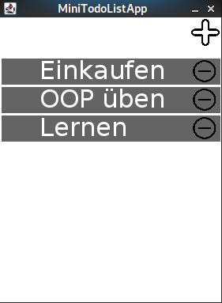
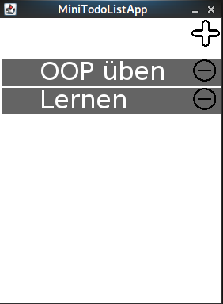
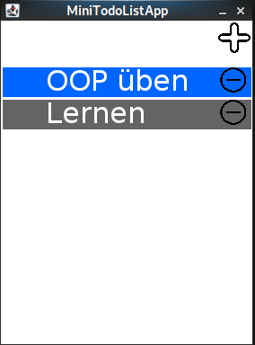

# U28-MiniTodoListApp

In diesem Übungsblatt implementieren Sie eine kleine App auf Basis der _GraphicsApp_, die eine Todo-Liste bereitstellt.

Überlegen Sie sich, in welche Komponenten Sie diese Applikation aufteilen wollen.
Trennen Sie die Daten von Einträgen von den Komponenten, mit denen diese in der App dargestellt werden sollen.
Legen Sie demnach entsprechende **packages** und **classes** an.

Die MiniTodoListApp soll folgende Funktionalitäten haben:
* Neue Einträge der Todoliste können über einen +-Button in der rechten oberen Ecke des Canvas erstellt werden
  * Verwenden Sie dazu das Bild `plus.png` aus dem Ordner `data/assets`.
  * Bei einem Klick auf den +-Button (Überschreiben Sie dazu die notwendige Methode in Ihrer _GraphicsApp_) werden Sie von der Konsole aufgefordert einen Eintrag (`String`) über die Tastatur einzugeben (`java.util.Scanner`).
  * Nach der Eingabe, wird ein neues TodoItem der Liste hinzugefügt.
  * Die Position des neuen Items ist immer unterhalb des zuvor untersten Items
* Ein TodoItem hat einen grauen Hintergrund, weißen Text und auf der rechten Seite einen Minusbutton
* Ein Klick auf den Minusbutton entfernt das entsprechende Item aus der Liste und Items, die darunter liegen rutschen entsprechend in der Liste nach oben

* Items können durch Klick abgehakt werden, was ihren Hintergrund blau einfärbt

* abgehakte Items können durch Klick wieder nicht-abgehakt gemacht werden, was ihren Hintergrund wieder grau einfärbt 

